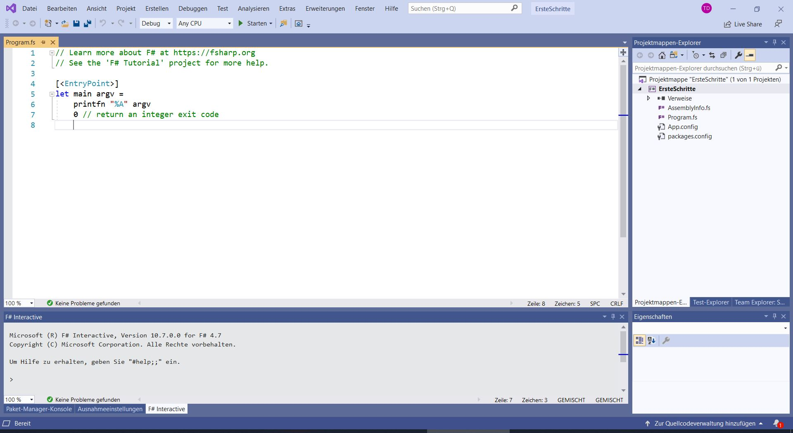

F# (F Sharp) ist eine von Microsoft entwickelte funktionale Programmiersprache im _.NET_-Universum. Die Syntax erinnert sehr stark an _OCaml_. Microsoft bietet mit _Visual Studio_ eine komplette Entwicklungsumgebung an, die neben F# auch mit vielen weiteren Sprachen zu recht kommt. In diesem Blogpost schauen wir uns erste Schritte im Zusammenspiel von F# mit Visual Code an und erklären einige ungewöhnliche Eigenarten. Wir erklären hier weniger die Sprache an sich. Dafür verweisen wir auf einen zeitnah erscheindenen Blogartikel zum Kennenlernen von F#.  
<!-- more start -->

## Bevor es los geht

Visual Studio ist in der vollumfänglichen Variante nur für Windows verfügbar und ist nicht zu verwechseln mit _Visual Studio Code_. Visual Studio ist in der [Community Edition](https://visualstudio.microsoft.com/de/vs/community/) kostenlos installierbar. Wir wählen bei der Installation das zusätzliche Paket (Workload) _.NET Desktopentwicklung_ aus. F# an sich ist in Visual Studio direkt enthalten.  

Wir öffnen Visual Studio und wählen _Neues Projekt erstellen_ auf dem Willkommensbildschirm. Im Suchfeld geben wir _F#_ ein und wählen _Konsolenanwendung (.NET Framework)_. Um das Projekt zu erstellen vergeben wir im nächsten Schritt noch den Namen _ErsteSchritte_ und wählen einen Speicherort aus.  

## Übersicht

Das folgende Bild zeigt den groben Aufbau in unserem neu angelegten Projekt.  

[](2020-01-20-f-sharp-visual-studio-erste-schritte/visual-studio-neues-projekt.jpg)

Links oben, im großen Fenster, ist die beispielhafte _Program.fs_ geöffnet. Rechts sehen wir den _Projektmappen-Explorer_. In unserer Projektmappe (Workspace) _ErsteSchritte_ haben wir momentan nur das gleichnamige Projekt (Solution) _ErsteSchritte_. In einer Projektmappe können verschiedene Projekte angelegt werden. Dabei kann jedes Projekte andere Abhängigkeiten und Einstellungen haben (siehe [Abschnitt Pakete mit NuGet installieren](#pakete-mit-nuget-installieren)).  

Unten sehen wir _F# Interactive_, die Konsole oder Repl, um direkt F#-Anweisungen ausführen zu können.

## F# Interactive

Um die _F# Interactive_ Konsole aufzurufen, können wir eine Codeanweisung, z. B. die `0` aus der beispielhaften _Program.fs_, markieren und im Kontextmenu _Interaktiv ausführen_ wählen. Die Anweisung wird ausgeführt und sollte in unserem Beispiel zu
```fsharp
val it : int = 0
```
führen. Da wir nur einen Wert eingegeben haben, bindet _F# Interactive_ diesen an die mutierbare Variable _it_. Wir können in späteren Anweisungen den Bezeichner `it` verwenden, um den Wert abzurufen, analog zur `ANS`-Funktionalität bei Taschenrechnern.  

Wir können im Fenster von `F# Interactive` auch direkt Anweisungen eintippen, z. B.:
```fsharp
4 + 5;;
```

Dabei müssen wir jede Anweisung mit `;;` beenden, um sie mit Enter ausführen zu können.

## Program.fs

Die _Program.fs_ ist der Startpunkt unserer Anwendung. Innerhalb dieser Datei sehen wir die Markierung `[<EntryPoint>]`, welche die Funktion mit dem Namen `main` als initialen Aufruf festlegt. Ändern wir diese Funktion ab zu:
```fsharp
[<EntryPoint>]
let main argv =
    printfn "%A" "Hallo zusammen!"
    0 // return an integer exit code
```
Wenn wir nun auf den Button _Starten_ (rechts neben den Einstellungen _Debug_ und _Any CPU_) gehen, sollte sich ein externes Konsolenfenster öffnen, welches aber sofort wieder verschwindet. Zum Starten können wir alternativ auch das Tastenkürzel _F5_ benutzen. 

Um die Ausgabe sehen zu können, kann die Ausführung auch mit offenbleibendem Terminal erfolgen: Dazu benutzen wir das Tastenkürzel _STRG + F5_.  

## Haltepunkte

Alternativ können wir die Zeile mit der `0` markieren und im Kontextmenü _Haltepunkt_, _Haltepunkt einfügen_ auswählen. Wenn wir nun auf Start gehen, unterbricht Visual Studio vor dieser Stelle die Ausführung. Als Folge davon, können wir die Ausgabe in der Konsole betrachten, indem wir das Konsolenfenster in den Vordergrund bringen. Sobald wir auf den Button _Weiter_ drücken, wird der Haltepunkt durchlaufen und unser Beispielprogramm ist beendet. Durch Rechtsklick auf den links sichtbaren Haltepunkt und _Haltepunkt löschen_ können wir diesen wieder entfernen.  

Haltepunkte eignen sich später sehr gut zum Debuggen. Hält das Programm an einem Haltepunkt an, zeigen alle bisher berechneten Variablen ihren Wert an, wenn man die Maus darüber hält.

## Projektmappen-Explorer

Im obigen Übersichtsbild haben wir rechts den Projektmappen-Explorer erwähnt. Hier sehen wir neben einigen Konfigurationsdateien unsere _Program.fs_. Wir können durch Rechtsklick auf unser Projekt, mit _Hinzufügen_, _Neues Element_, _Quelldatei_ eine neue Modul-Datei hinzufügen. Wir nennen diese _MeinModul.fs_.  

Die Datei erscheint im Projektmappen-Explorer an letzter Stelle. Die Dateien werden anhand ihrer Reihenfolge geladen. Da wir später _MeinModul_ aus der Hauptmethode in _Program.fs_ aufrufen wollen, müssen wir _MeinModul.fs_ nach oben schieben. Dazu klicken wir auf die Datei und navigieren sie mit _ALT + PFEIL OBEN_ nach oben. Drag und Drop stellt eine andere Funktionalität dar. Dieses Verhalten soll evtl. in einer zukünftigen Visual Studio Version geändert werden.


## Live-Kompilierung mit IntelliSense

Wir bearbeiten unsere neu erstellte Modul-Datei und definieren uns die Kreiszahl. Dabei fügen wir zuerst am Ende von `module MeinModul` ein `=`-Zeichen an.
```fsharp
module MeinModul = 

    /// Pi als gerundete Dezimalzahl
    let pi : decimal = 
        3.141M
```

Wenn wir nun auf _Starten_ gehen, erhalten wir folgende Fehlermeldung: _Dateien in Bibliotheken oder Anwendungen mit mehreren Dateien müssen mit einer Namespace- oder Moduldeklaration beginnen. [...] Nur in der letzten Quelldatei einer Anwendung darf eine solche Deklaration ausgelassen werden._


[](2020-01-20-f-sharp-visual-studio-erste-schritte/visual-studio-fehlermeldung.jpg)

Wir fügen der _MeinModul.fs_ als erste Zeile
```fsharp
namespace ErsteSchritte
```
hinzu. Das Programm startet jetzt ohne Fehlermeldung. Evtl. bleibt die vorherige Meldung noch in der _Fehlerliste_ sichtbar. Um dies zu lösen, klicken wir rechts auf _ErsteSchritte_ im Projektmappen-Explorer und wählen zuerst _Projekt entladen_ und anschließend _Projekt erneut laden_. Dieses Verhalten hängt mit der neu erstellten _MeinModul.fs_ und der dynamischen Generierung/Überprüfung mit _IntelliSense_ zusammen. _IntelliSense_ compiliert ständig im Hintergrund, um so Meldungen über falschen Syntax, nicht passende Typen oder sonstige Fehler aufmerksam zu machen. Entsprechende Stellen werden rot unterstrichen. Zusätzlich sind sie in der _Fehlerliste_ sichtbar, sofern dort der Modus _Nur IntelliSense_ oder _Erstellen + IntelliSense_ gewählt ist.
Zusätzlich bietet uns _IntelliSense_ die Möglichkeit der Autovervollständigung.

## Aufruf einer Funktion

In _Program.fs_ ändern wir die Ausgabe von "Hallo zusammen!" zu Pi, dafür ersetzen wir die Zeile mit `printfn` durch
```fsharp
printfn "%A" ErsteSchritte.MeinModul.pi
```
Durch Angabe des Namensraum, gefolgt von der Modulbezeichnung, können wir alle nicht privaten Funktionen und Werte aufrufen. Zum Test können wir in _MeinModul.fs_ `let pi` durch `let private pi` ersetzen. In der _Program.fs_ meldet uns nun _IntelliSense_, dass wir auf diesen Wert nicht zugreifen können. _IntelliSense_ erkennt dateiübergreifende Änderung erst nachdem man die Datei gespeichert hat.

## Test-Infrastruktur

Da auch bei der Rundung von Pi Fehler entstehen können erstellen wir unmittelbar unseren ersten Testfall. Wir legen uns im Projektmappen-Explorer einen Ordner _Test_ an und erstellen darin die Quellcodedatei `MeinModulTest.fs`. Wir schieben mit _ALT + PFEIL UNTEN_ die _Program.fs_ wieder an die letzte Stelle. Die dort markierte _main_-Methode muss immer in der letzten Datei stehen. Falls erneut die Meldung bzgl. Namespace- oder Moduldeklaration erscheint, müssen wir wie oben beschrieben unser Projekt _ErsteSchritte_ ent- und erneut laden.  

Als Test-Framework benutzen wir im Folgenden _NUnit_ und _FsUnit_. Diese Pakete installieren wir mit _NuGet_.

## Pakete mit NuGet installieren

Im Projektmappen-Explorer können wir über das Kontextmenü eines Projekts (Solution) oder im Kontextmenü der Projektmappe (Workspace) den Paketmanager aufrufen (_NuGet Pakete verwalten_ bzw. _NuGet Pakete für Projektmappe verwalten_). Je nach dem was wir wählen, installieren wir das Paket für ein einzelnes Projekt oder für die ganze Projektmappe und damit sichtbar für alle Projekte.  

Um ein Paket zu installieren suchen wir ein Paket im Reiter _Durchsuchen_. Wir setzen rechts den Haken vor _Projekt_ und gehen auf _Installieren_. Nach Bestätigung einer Meldung wird das Paket installiert. Wir installieren die Pakete:

* NUnit
* NUnit3TestAdapter
* FsUnit

_NUnit_ stellt die Grundfunktionalität dar. _NUnit3TestAdapter_ ist ein sogenannter Test-Adapter für Visual Studio. Damit lassen sich alle Tests mit dem Test-Explorer von Visual Studio verwalten. _FsUnit_ stellt eine Reihe von Methoden für die Forumulierung von Prüfungen bereit.

## Testfall definieren und ausführen

Zurück in unserer noch leeren _MeinModulTest.fs_ legen wir erneut einen Namensraum und die Modulstruktur fest. Weiter binden wir unsere zuvor installierten Test-Tools ein:
```fsharp
module MeinModulTest =
    open NUnit.Framework
    open FsUnit
```
Ein Testfall besteht aus der Markierung `[<Test>]` und einer Funktionsdefinition. Dabei gibt der Funktionsname den Testnamen an. Damit dieser auch Leerstellen und beliebige Groß-/Kleinschreibung enthalten kann, fassen wir diesen in doppelte _Backticks_ ``` `` ``` ein. Zum Beispiel:
```fsharp
[<Test>]
let ``Defintion of Pi`` () =
   ErsteSchritte.MeinModul.pi |> should equal 3.141M
```
Um den Testfall auszuführen, gehen wir in den Test-Explorer (_Ansicht_, _Test-Explorer_) und drücken auf den Vorspulen-Pfeil _Alle Tests ausführen_. Damit wird das Projekt gebaut und unser Testfall wird vom Test-Explorer gefunden. Drücken wir erneut _Alle Tests ausführen_ wird er ausgeführt und sollte auch grün werden.  

[](2020-01-20-f-sharp-visual-studio-erste-schritte/visual-studio-tests.jpg)

Die Tests werden nach Projekten, Namensräume und Modulen gruppiert. In unserem Fall scheint das übertrieben zu sein, bei mehreren Hundert Tests kann später insbesondere durch die Verwendung von Namensräumen einzelne Test-Module weiter gruppiert werden. Innerhalb eines Moduls werden die Tests nach ihrer Position in der Datei sortiert.

## Fazit

Visual Studio bietet eine Menge Funktionen zur Entwicklung von F# an. Dabei lassen sich einige Eigenheiten, wie die Sortierung der Projektdateien, nicht leugnen. In diesem Artikel haben wir einen schnellen Rundgang über die Projektstruktur, die Paketverwaltung oder das Testen vollzogen. In einem folgenden Blogartikel schauen wir uns F# an sich näher an. Dort machen wir uns mit dem Syntax der Sprache vertraut.
 
<!-- more end -->
